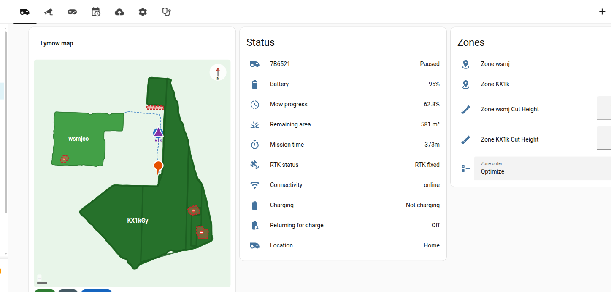
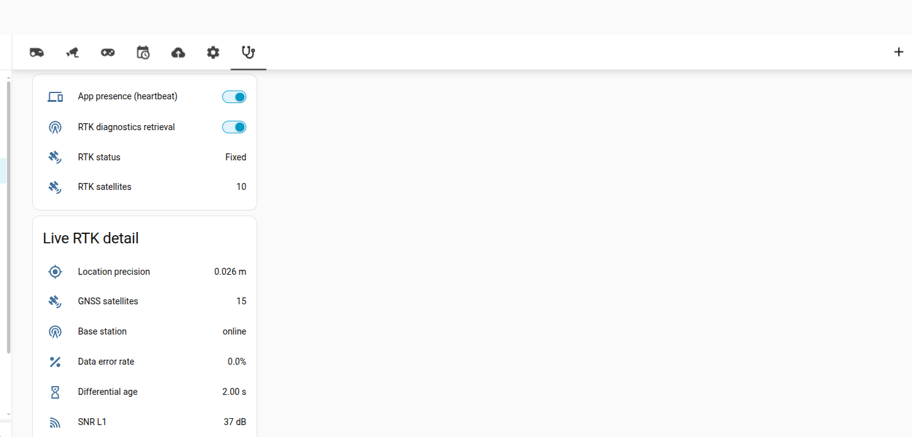

# ha-lymow

Home Assistant custom integration for [Lymow](https://www.lymow.com/) robotic lawn mowers.

> **Status**: Working prototype — cloud auth + MQTT real-time state implemented.

## Support

If you find this integration useful, you can buy me a coffee ☕

[](https://www.buymeacoffee.com/jhara)

## Installation

### HACS (recommended)

[](https://my.home-assistant.io/redirect/hacs_repository/?owner=8408323&repository=ha-lymow&category=integration)

Or manually:

1. In HACS, go to **Integrations → ⋮ → Custom repositories**.
2. Add `https://github.com/8408323/ha-lymow` as an **Integration**.
3. Search for **Lymow** and click **Download**.
4. Restart Home Assistant.

### Manual

1. Copy `custom_components/lymow/` to your HA `config/custom_components/` directory.
2. Restart Home Assistant.

## Configuration

1. Go to **Settings → Devices & Services → Add Integration**.
2. Search for *Lymow*.
3. Choose your sign-in method and follow the form:
   - **Email and password** keeps the existing Cognito SRP sign-in and can auto-detect the account region.
   - **Google Account** uses Lymow's Cognito Hosted UI. Select the same region as the Lymow account before opening the sign-in link.

### Google Account sign-in

Lymow's Cognito client redirects Google sign-in to the mobile-app address `myapp://callback/`. A desktop browser may report that it cannot open this address. Copy the complete callback address from the browser and paste it into the Home Assistant form. If you copy only the authorization code, also copy the callback's `state` value into the state field.

Submit the callback promptly because the authorization code is short-lived and can be used only once. If it expires, open the Google sign-in link again to start a fresh attempt.

Home Assistant stores the OAuth refresh token in the integration's config entry. Restarts and routine token expiry are handled automatically without a Google password. If Google or Lymow revokes the refresh token, Home Assistant marks the entry as requiring reauthentication; open the Lymow integration in **Settings → Devices & Services** and complete the Google sign-in prompt again. Password entries use the corresponding password reauthentication form.

OAuth callbacks, authorization codes, and access, ID, or refresh tokens are credentials. Never post them in GitHub issues, logs, screenshots, or support requests.

## Entities

Each mower device exposes the following entities:

### Lawn mower

| Entity | Features |
|--------|----------|
| Mower | Start mowing, Pause, Return to dock |

### Sensors

| Entity | Unit | Enabled by default |
|--------|------|--------------------|
| Battery | % | ✅ |
| Error code | — | ✅ |
| Wi-Fi signal | — | ✅ |
| LTE signal | — | ✅ |
| Wi-Fi RSSI | dBm | ❌ |
| Connectivity | — | ✅ |
| Firmware version | — | ✅ |
| MCU version | — | ✅ |
| IP address | — | ✅ |
| RTK satellites | — | ✅ |
| Total mowed area | m² | ✅ |
| Mow progress | % | ✅ |
| Mow strip count | — | ❌ |

### RTK diagnostics

Detailed RTK GNSS health — location precision, per-band satellite counts and SNR, base-station status, data-error rate, differential age, LoRa bandwidth, antenna gain — is exposed as **Diagnostic** sensors. The robot only streams this detail to a client it sees as a connected app, so two switches control it:

| Switch | What it does |
|--------|--------------|
| App presence | Registers HA as a connected app via a periodic heartbeat. Kept separate because registering presence may affect other robot behaviour. |
| RTK diagnostics | Keeps the RTK sensors live **without the Lymow app open**. Requires App presence — turning it on enables presence automatically and tells you where the presence toggle is. |

Both are **off by default** (they run a continuous MQTT poll). Turn on **RTK diagnostics** to stream live RTK data; turn it off — or turn off **App presence** — to stop.

#### On a dashboard

The switches and sensors are plain entities, so you can surface them on any dashboard. This example keeps the two toggles always visible and shows the live metrics only while RTK diagnostics is on — a card `visibility` condition hides the detail card when it's off:

```yaml
type: grid
cards:
  - type: heading
    heading: RTK diagnostics
    icon: mdi:satellite-uplink
  - type: entities
    entities:
      - entity: switch.lymow_THING_app_presence
        name: App presence
      - entity: switch.lymow_THING_rtk_diagnostics
        name: RTK diagnostics
      - sensor.lymow_THING_rtk_status
      - sensor.lymow_THING_rtk_satellites
  - type: entities
    title: Live RTK detail
    visibility:
      - condition: state
        entity: switch.lymow_THING_rtk_diagnostics
        state: "on"
    entities:
      - sensor.lymow_THING_location_precision
      - sensor.lymow_THING_l1_snr
      - sensor.lymow_THING_rtk_base_station
      # … and the remaining rtk_* sensors (SNR/satellites per band, CW interference,
      #   antenna gain, DC voltage, LoRa bandwidth, data error rate, differential age)
```

Replace `lymow_THING` with your mower's entity-ID prefix (see the device page — e.g. `sensor.<mower>_l1_snr`).

### Per-zone entities (one set per configured mowing zone)

| Entity | Description |
|--------|-------------|
| Zone enabled (switch) | Enable or disable the zone for scheduled mowing |
| Cut height (number) | Blade height for this zone (mm) |
| Path spacing (number) | Mowing path spacing for this zone |

## Services

Call these from **Developer Tools → Actions** or in automations. All target a `lawn_mower.*` entity.

| Service | What it does |
|---------|--------------|
| `lymow.start_zone` | Mow one or more specific zones by hash ID |
| `lymow.delete_zone` | Delete a go-zone from the map |
| `lymow.add_zone` / `lymow.merge_zones` / `lymow.split_zone` | Create / combine / cut zones |
| `lymow.update_zone_polygon` | Replace a zone's boundary with a new polygon (used by the map card's edit mode) |
| `lymow.pin_and_go` | Mow a small area around a point |
| `lymow.query_map` / `lymow.query_schedules` / `lymow.query_*` | Ask the robot to (re)send map / schedule / diagnostic data |
| `lymow.start_video_session` | Open a Kinesis Video WebRTC session (returns channel ARN + temporary credentials for an external viewer) |
| `lymow.restore_backup_map` / `lymow.delete_backup_map` / `lymow.rename_backup_map` | Manage saved backup maps (object key comes from the *Backup maps* sensor's `backups` attribute) |
| `lymow.set_device_name` | Set the robot's cloud display name |
| `lymow.ble_drive` | Local Bluetooth manual drive (see below) |

## Bluetooth manual drive

The robot accepts a local Bluetooth joystick command over GATT. To use it:

1. Make sure Home Assistant has the [Bluetooth integration](https://www.home-assistant.io/integrations/bluetooth/) set up with an adapter in range of the robot.
2. In the Lymow integration's **Configure** (options) dialog, set the robot's **BLE address** (MAC).
3. Call `lymow.ble_drive` with `linear` (−0.5…0.5 m/s, forward +), `angular` (−0.6…0.6 rad/s, left +) and optional `duration` (0…5 s):

```yaml
action: lymow.ble_drive
target:
  entity_id: lawn_mower.lymow_my_mower
data:
  linear: 0.3
  angular: 0.0
  duration: 1.0
```

Velocities are clamped to the safe range and the duration is capped at 5 s; the robot always stops when the call ends.

## Map card

A custom Lovelace card renders the mowing map and lets you edit zone boundaries:

```yaml
type: custom:lymow-map-card
entity: sensor.lymow_my_mower_map        # the map sensor
mower_entity: lawn_mower.lymow_my_mower   # required for mowing + editing
title: My lawn                            # optional
```

- **View mode** — tap a go-zone to select it, then *Mow selected*.
- **Edit mode** — tap *Edit map*, tap a go-zone, then drag the vertex handles, tap an edge **+** to insert a vertex or a vertex's **✕** to delete one, and *Save* (writes via `lymow.update_zone_polygon`).

## Screenshots

| Dashboard & map | RTK diagnostics |
|---|---|
|  |  |

→ [See all screenshots](docs/SCREENSHOTS.md) (Settings, Backups, Schedules, integration page)

## Example dashboard

A complete dashboard — **Overview/map, Camera, Drive, Schedules, Backups, Settings, and Diagnostics** (with the RTK section) — is in [`examples/dashboard.yaml`](examples/dashboard.yaml). Every custom card it uses ships with the integration.

To use it: **Settings → Dashboards → Add dashboard**, open the new dashboard, then **⋮ → Edit dashboard → ⋮ → Raw configuration editor**, and paste the file. Replace `your_mower` with your mower's entity-id prefix (check its device page, e.g. `sensor.<prefix>_map`).

Two caveats: a few sensors (Wi-Fi RSSI, the RTK detail metrics, …) are **disabled by default** — enable them on the device page if a row shows *unavailable*; and **per-zone** entities depend on your own map, so they're left out of the example.

## Contributing

Pull requests are welcome. Please open an issue first to discuss what you'd like to change.

## License

MIT
