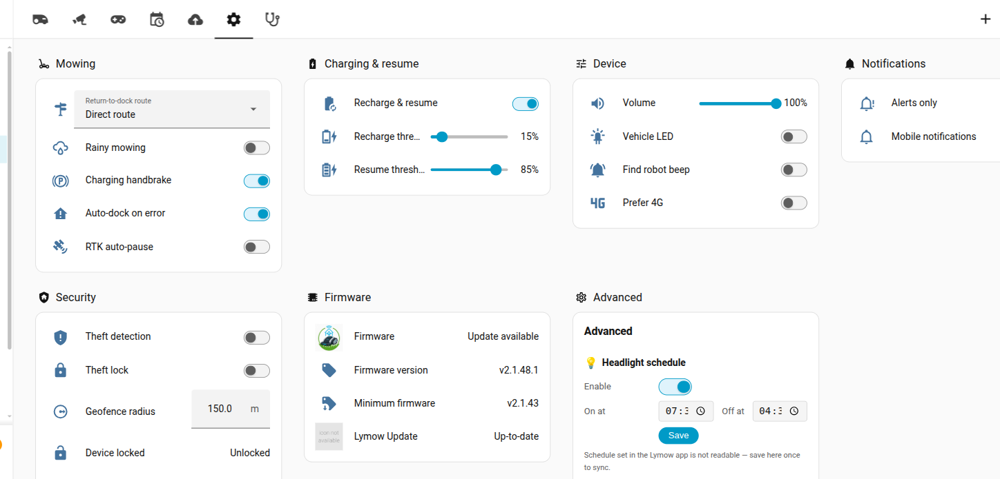
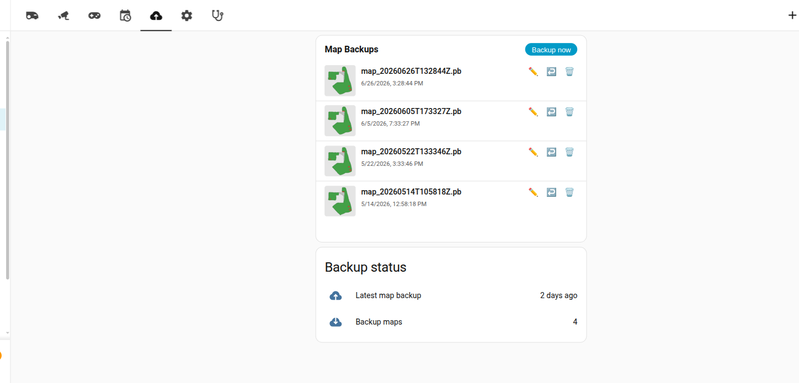
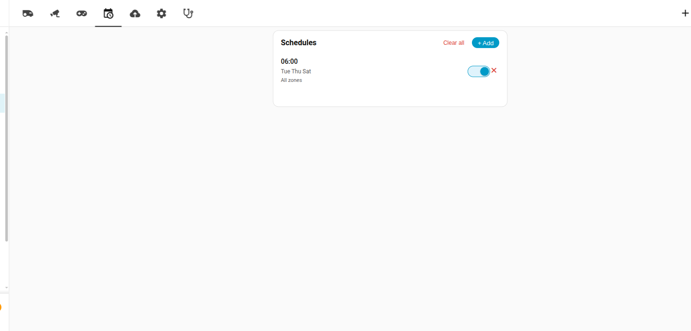
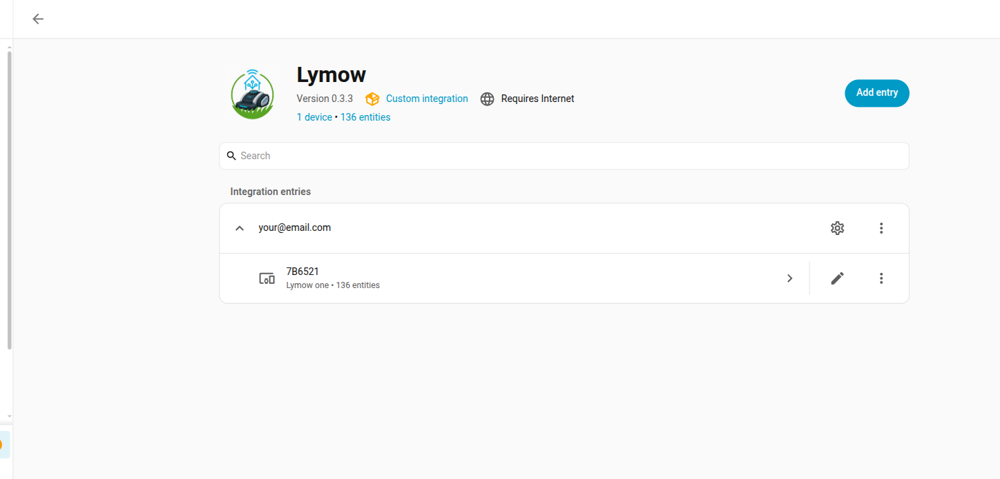

# Screenshots

All views of the example dashboard ([`examples/dashboard.yaml`](../examples/dashboard.yaml)).

## Overview — map card + live status

## Settings

## Backups

## Schedules

## RTK diagnostics

## Integration setup

